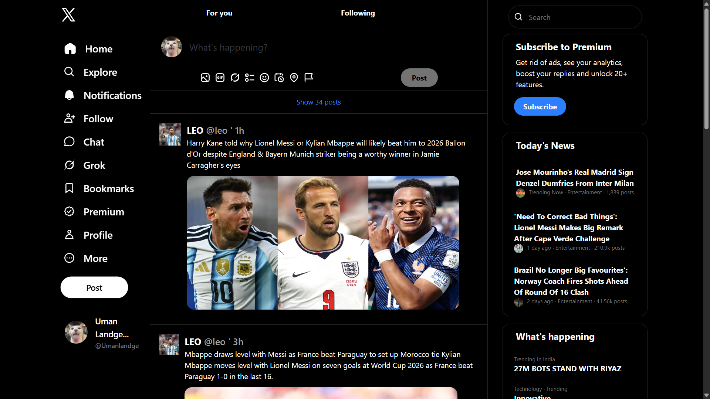

# 🐦 X (Twitter) Clone

A modern **X (Twitter) Clone UI** built using **HTML** and **Tailwind CSS**. This project was created to practice frontend development by recreating the layout and design of the X (Twitter) homepage.

## 🚀 Features

- 🏠 Left Navigation Sidebar
- 📰 Main News Feed
- 🔍 Search Bar
- ⭐ Premium Subscription Card
- 🔥 Trending News Section
- 👥 Who to Follow Section
- 🖼️ News Posts with Images
- 🎨 Modern UI using Tailwind CSS
- ✨ Hover Effects & Smooth Transitions
- 📱 Responsive-ready structure (Responsive improvements in progress)

## 🛠️ Built With

- HTML5
- Tailwind CSS

## 📂 Project Structure

```
├── index.html
├── output.css
├── photo.png
└── README.md
```

## 🎯 Purpose

The main goal of this project was to improve my understanding of:

- HTML Structure
- Tailwind CSS
- Flexbox Layout
- UI Design
- Hover Effects
- Transitions
- Building large frontend layouts

## 📸 Preview

<p align="center">
  
</p>

## 🔮 Future Improvements

- Make the website fully responsive
- Convert the project into React
- Fetch real-time posts using an API
- Add Dark/Light Mode
- Improve accessibility

## 👨‍💻 Author

**Uman Landge**

GitHub: https://github.com/umaan_74

---

⭐ If you like this project, don't forget to give it a star!